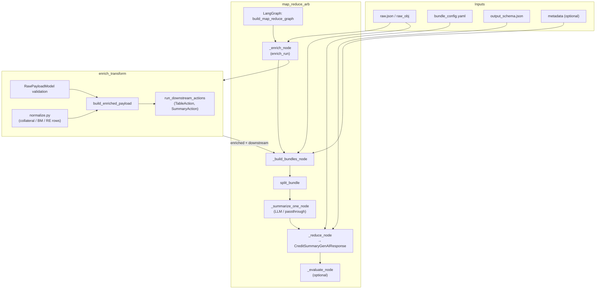
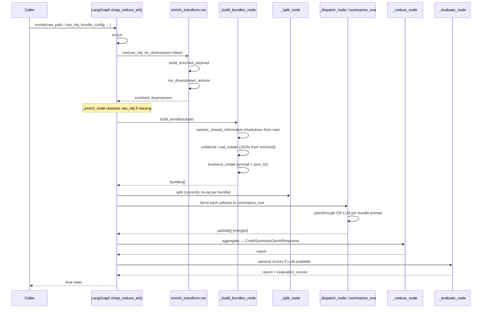

# Methodology: `enrich_transform` and `map_reduce_arb`

This document explains how the **`enrich_transform`** package and the **`map_reduce_arb`** LangGraph pipeline fit together: what each layer owns, how data flows, and a concrete walkthrough.

---

## Roles at a glance

| Layer | Responsibility |
|--------|----------------|
| **`enrich_transform`** | Take nested **raw** JSON (credit / partner payload). **Validate** with Pydantic (`RawPayloadModel`). **Normalize** into relational rows (Pandas), **aggregate**, and emit a compact **enriched** JSON tree (`collateral`, `business_model`, `real_estate`). Then run **downstream actions** per section: markdown tables, summary dicts, and JSON strings for optional LLM input. |
| **`map_reduce_arb`** | Orchestrate **one graph run**: call enrich, **materialize bundles** (section-sized units with a prompt and/or passthrough payload), **map** them to parallel workers, **summarize** (LLM or passthrough), **reduce** into `CreditSummaryGenAIResponse`, optionally **evaluate** LLM sections. Ordering and report section titles come from **`bundle_config.yaml`**. |

`map_reduce_arb` does not duplicate enrich logic; it **imports** `enrich_transform.cli.run` inside the graph’s enrich node.

---

## Component diagram

High-level view of packages and the main internal pieces.

**Bundle sources (conceptual):**

- **From enrich downstream:** `business_model` uses `json_str` (and table markdown for passthrough-style sections where configured).
- **From enrich enriched JSON:** `collateral`, `real_estate` passthrough bundles use the **enriched** subtree (not the downstream `json_str` mirror), for stable structured JSON in the report.
- **From raw only:** `partner_shared_information` is formatted in `map_reduce_arb` from **`raw_obj`** (plus merged `metadata`), without going through Pandas enrich.

---

## Sequence diagram

Typical run when `bundles` are **not** pre-injected (full pipeline).

If the caller passes **`bundles`** directly, **`enrich`** and **`build_bundles`** are skipped (tests and custom integrations).

---

## Flow in prose

1. **Entry**  
   You call `build_map_reduce_graph().invoke({...})` with at least `raw_obj` or `raw_path`, plus `bundle_config` and `output_schema`. Optional `metadata` is merged into the raw view used for partner-facing text.

2. **Enrich (`_enrich_node`)**  
   - Resolves a full **`raw_obj`** (from state, `raw_path`, or default `enrich_transform/raw.json`).  
   - Calls **`enrich_transform.cli.run`**, which:  
     - Validates **`RawPayloadModel`**.  
     - Builds **enriched** sections via **`build_enriched_payload`** (collateral aggregates, business-model rows, real-estate rows).  
     - Runs **`run_downstream_actions`** for `collateral`, `business_model`, `real_estate`, producing per-section **`json_str`**, **`table_md`**, **`summary`**, **`summary_md`**.

3. **Build bundles (`_build_bundles_node`)**  
   For each configured section (order defined in code + `bundle_config`):  
   - **Partner Shared Information:** deterministic markdown from **`raw_obj`** / metadata (no LLM).  
   - **Collateral / real estate:** passthrough **enriched** JSON as string payload.  
   - **Business model:** LLM path uses **`downstream[...].json_str`**; passthrough path would use table markdown (per prompt rules in `prompts.py`).  
   Each item becomes a **`Bundle`** (`field_name`, `prompt`, `payload`).

4. **Split**  
   `split_bundle` may duplicate or shard bundles; today it returns a single bundle per input.

5. **Map–reduce**  
   LangGraph **`Send`**s each bundle to **`summarize_one`**:  
   - `prompt == PROMPT_NONE` → **`summarize_passthrough`** (payload copied to report text).  
   - Otherwise → **`summarize_with_prompt`** (LLM + payload).  
   Partials are merged, then **`_reduce_node`** builds **`CreditSummaryGenAIResponse`**: sections and subsections ordered by **`bundle_config.yaml`**.

6. **Evaluate**  
   If an LLM is configured, **`_evaluate_node`** scores LLM-produced sections and the rendered report; passthrough sections are not scored as LLM summaries.

7. **Output**  
   You get structured JSON (Pydantic) and can render markdown via **`render_to_markdown`**.

---

## Sample flow (concrete)

**Goal:** Produce a credit-style report from `enrich_transform/raw.json`.

| Step | What happens | Example artifact |
|------|----------------|------------------|
| 1 | `invoke({"raw_path": ".../enrich_transform/raw.json", "bundle_config": load_bundle_config(...), ...})` | Graph starts at `enrich`. |
| 2 | `enrich_run` validates nested `data.data.legalEntities[...]` | `RawPayloadModel` OK or validation error. |
| 3 | `build_enriched_payload` flattens collaterals → aggregates | `enriched["collateral"]` with `aggregate` + `grand_total`. |
| 4 | Same for business model / real estate rows | `enriched["business_model"]`, `enriched["real_estate"]`. |
| 5 | `run_downstream_actions` | `downstream["business_model"]["json_str"]` = indented JSON string; `table_md` = markdown table for that section. |
| 6 | `_build_bundles_node` | Bundle `partner_shared_information`: markdown string. Bundle `collateral`: `json.dumps(enriched["collateral"])`. Bundle `business_model`: prompt + `json_str`. |
| 7 | `summarize_one` | Partner + collateral + real_estate: text = payload. Business model: LLM summary (if keys set) or error path per config. |
| 8 | `reduce` | One **SummarySection** per distinct `section_title` in YAML; each **Bundle** → **SummarySubSection**. |
| 9 | `evaluate` | Optional numeric scores on LLM sections + full report markdown. |

**CLI mirror:**  
`python -m map_reduce_arb.run_summarizer` sets `raw_path` to `enrich_transform/raw.json`, loads `bundle_config.yaml`, invokes the graph, writes `map_reduce_arb/pydantic_output.json`, and prints markdown.

---

## Configuration knobs

- **`map_reduce_arb/bundle_config.yaml`** — `field_name`, `section_title`, `order`, optional `display_name`. Must align with bundles produced in `_build_bundles_node`.
- **`map_reduce_arb/prompts.py`** — `get_prompt_for_section`: `PROMPT_NONE` = passthrough; otherwise LLM prompt text.
- **`enrich_transform`** — Section list in `run_downstream_actions(..., sections=[...])` defaults to `collateral`, `business_model`, `real_estate`; enrich keys must stay consistent with bundle builder expectations.

---

## Related files

| Area | Files |
|------|--------|
| Enrich pipeline | `enrich_transform/cli.py`, `enrich_transform/pipeline/build_enriched.py`, `enrich_transform/pipeline/normalize.py`, `enrich_transform/actions/dispatcher.py` |
| Graph | `map_reduce_arb/graph.py`, `map_reduce_arb/prompts.py`, `map_reduce_arb/agents.py` |
| Partner block | `map_reduce_arb/partner_shared_info.py`, `map_reduce_arb/update.md` |
| Report shape | `map_reduce_arb/report_schemas.py` |

Diagrams use [Mermaid](https://mermaid.js.org/); they render in GitHub, many IDEs, and static site generators that support fenced `mermaid` code blocks.
